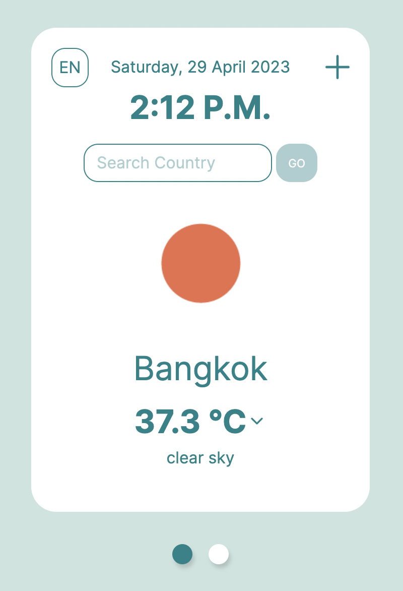
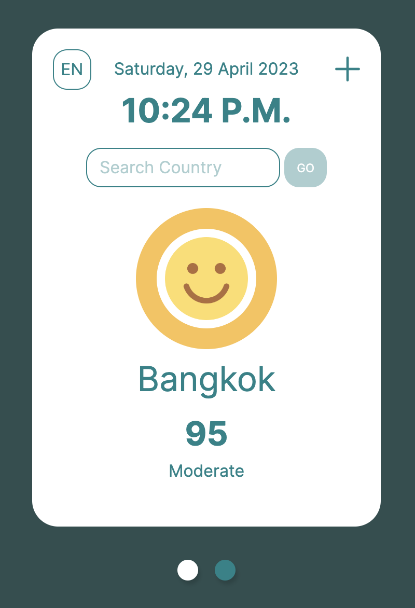
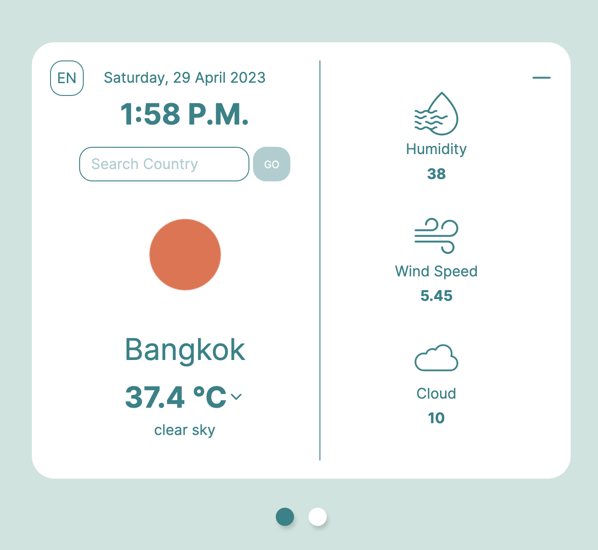
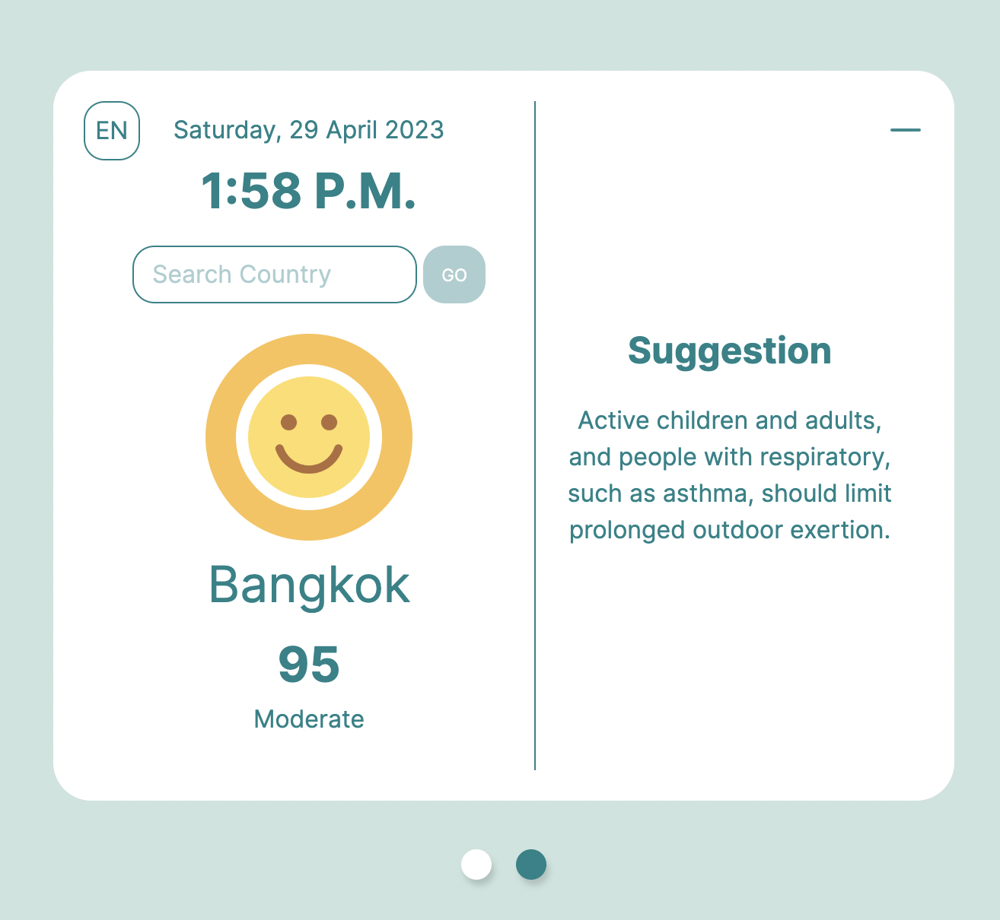

# Weather App

This is a simple weather app built using React and Bootstrap. It allows users to search for the weather of a location and provides them with the current weather conditions along with additional information such as temperature, humidity, wind speed, and PM 2.5 condition. Additionally, it supports changing the language and temperature unit.

 

## Features

- Search for the weather of a location
- Displays current weather conditions
- Displays additional weather information such as temperature, humidity, wind speed, and PM 2.5 condition
- Supports changing the language
- Supports changing the temperature unit
- Easy-to-use interface

   

## Installation

To install and run this app on your local machine, follow these steps:

1. Clone the repository to your local machine
2. Navigate to the project directory using the terminal
3. Run the command 'npm install' to install all the required dependencies
4. Run the command 'npm start' to start the app
5. Open your browser and go to 'http://localhost:3000/'

## Usage

To use the app, follow these steps:

1. Enter the name of a location in the search bar
2. Press the search button
3. The app will display the current weather conditions including the weather condition, weather icon, and temperature.
4. Click on the plus sign to see additional information such as humidity, wind speed, and cloudiness.
5. To see the PM 2.5 condition, flip the card by clicking on the circular button at the bottom of the screen
6. Click on the plus sign to see suggestion.
7. To change the language, click on the language dropdown and select your preferred language
8. To change the temperature unit, click on the temperature unit dropdown and select your preferred unit
